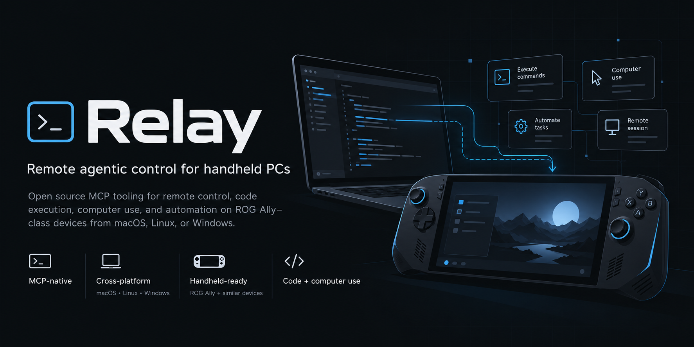
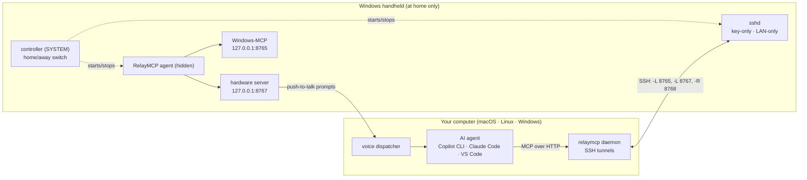

<p align="center">
  
</p>

<p align="center">
  <a href="https://github.com/brennengreen/RelayMCP/actions/workflows/ci.yml"></a>
  <a href="LICENSE"></a>
  
  
</p>

<p align="center">
  <a href="#quick-start"><strong>Quick start</strong></a>
  &middot;
  <a href="https://github.com/brennengreen/RelayMCP/discussions/5"><strong>Join early testers</strong></a>
  &middot;
  <a href="docs/security.md"><strong>Security model</strong></a>
</p>

**RelayMCP lets your AI agent operate your Windows handheld.** Your ROG Ally, Legion Go, or similar device becomes a
set of [MCP](https://modelcontextprotocol.io) tools on your laptop. GitHub Copilot CLI, Claude Code, VS Code, or any
MCP client can then see the screen, tap, type, press controller buttons, run PowerShell, change settings, and talk
back out loud. You can also hold two buttons on the handheld and just *ask*.

```text
you ▸ copilot -p "Open Minecraft on my Ally, and once it's on the title screen, set brightness to 40%"
      ● ally Screenshot   ● ally App (launch Minecraft)   ● ally WaitFor   ● ally-handheld set_brightness
      Minecraft is on the title screen and brightness is at 40%.
```

## What you get

- 🖥️ **Computer use.** Screenshots, UI-tree snapshots, clicks, typing, app launching, PowerShell, files and the
  registry, via [Windows-MCP](https://github.com/CursorTouch/Windows-MCP).
- 🎮 **Handheld hardware** ([43 tools](docs/tools.md)):
  - a virtual Xbox controller (games see it) with millisecond-accurate sequences, plus reading the real one and rumble
  - real multi-touch (tap, swipe, pinch), scan-code keys that work in games, mouse-look
  - speakers, microphone, system-audio capture, brightness, resolution/refresh rate, power mode, battery and CPU load
- ⚡ **Built for agents that are fast and frugal:**
  - `observe` reads the screen as text with tap points (~150 tokens), and `screenshot` returns a small JPEG in
    ~70 ms (~730 tokens, a third of a full-size PNG)
  - `act` does a whole sub-goal in one call ("focus the game, tap *Play*, wait for *Servers*")
  - `behavior` runs reflex loops on the handheld itself: react to the screen in ~35 ms, track a target, or walk a
    menu to an item by its text, with no model round trips
  - `proc` talks to long-running consoles (a game server), and `powershell` keeps a warm session (~50 ms per call)
  - input results say which window really had focus, and focus stolen by pop-ups is put back
- 🗣️ **Voice prompts.** Hold **View + Menu** (or tap *Ask Copilot*) and speak. The handheld transcribes locally
  (Whisper), your agent does the work, and the reply is spoken in a natural neural voice (Kokoro, also local).
- 🏠 **Home-only by design.** Everything switches on only on your home network, recognized by your router's hardware
  address. On any other network, or offline, nothing listens and nothing phones home. Normal handheld use is never
  affected.
- 🔐 **SSH underneath.** Key-only OpenSSH, local-subnet firewall, MCP servers bound to `127.0.0.1` on the handheld and
  reached only through the tunnel. See the [security model](docs/security.md).
- 🧰 **Zero-typing handheld setup.** One command on your computer builds a kit. Double-tap it on the handheld (from a
  USB stick, or with a one-liner) and you're done. A *Repair RelayMCP* shortcut fixes anything later.
- ☕ **Keep-awake that respects your battery.** The handheld stays awake only while an agent is using it (or for as
  long as you ask), then sleeps normally.

## Quick start

You need a Windows 11 handheld (tested on an original ROG Ally) and a Mac, Linux or Windows computer on the same home
network, with [uv](https://docs.astral.sh/uv/) and OpenSSH. Voice prompts use
[GitHub Copilot CLI](https://github.com/github/copilot-cli) by default.

**1. Install RelayMCP on your computer**

```sh
uv tool install "relaymcp[voice] @ git+https://github.com/brennengreen/RelayMCP"
```

(`[voice]` adds a warm Copilot runtime that makes voice prompts about twice as fast; leave it out for a
standard-library-only install.)

**2. Run setup** (it asks two questions, then builds the handheld's kit and waits for it to check in)

```sh
relaymcp setup
```

**3. On the handheld** (signed in, at home), do either of these, then choose **Yes** when Windows asks:

- copy the kit folder it printed to a USB drive and double-tap **`Setup RelayMCP.cmd`**, or
- press <kbd>Win</kbd>+<kbd>R</kbd> and run the one-liner it printed: `powershell -c "irm http://<your-computer>:8766/<token> | iex"`

The first run takes a few minutes: it downloads Python, the speech models and the voice. When the handheld checks in,
`relaymcp setup` trusts its SSH key, starts the tunnel and runs a health check:

```text
  ✓ Tunnel (tools): up 192.168.1.23
  ✓ MCP 'ally': http://127.0.0.1:8765/mcp (20 tools)
  ✓ MCP 'ally-handheld': http://127.0.0.1:8767/mcp (40 tools)
  ✓ Voice dispatcher: agent=copilot permissions=handheld
  ✓ Device agent: windows-mcp up (restarts 0), hardware up (restarts 0)
```

Then try it:

```sh
copilot -p "Take a screenshot of my handheld and tell me what's on screen"
relaymcp say "Hello from RelayMCP"
```

> **Trying RelayMCP on your handheld?** Add your model, host OS, MCP client and result to the
> [early tester roll call](https://github.com/brennengreen/RelayMCP/discussions/5). Reports that work without changes
> are just as valuable as bug reports. If RelayMCP is useful, star the repository to help other handheld owners find it.

To use other MCP clients, run `relaymcp mcp --print` for ready-made config (Claude Code, VS Code, generic JSON). The
full walkthrough is in [docs/getting-started.md](docs/getting-started.md).

## How it works



- **On your computer:** `relaymcp daemon` runs as a background service (launchd, systemd or a logon task). It keeps
  two SSH connections open while the handheld is reachable. One forwards the MCP ports to your `127.0.0.1`; the
  other reverse-forwards the voice dispatcher to the handheld.
- **On the handheld:** a SYSTEM *controller* task checks the network at boot, at login, on every network change and
  every 15 minutes. It runs SSH and the *agent* only at home. The agent is one windowless `pythonw` process that runs
  both MCP servers with hidden consoles, restarts them if they crash, and keeps the device awake while it's in use.
  There are no `cmd`/`conhost` tricks, so antivirus heuristics have nothing to object to.

The details (what's installed where, the job-object lifecycle, and the network rules) are in
[docs/how-it-works.md](docs/how-it-works.md).

## Voice prompts

Hold **View + Menu** for about a second (or tap **Ask Copilot**, or press <kbd>Ctrl</kbd>+<kbd>Alt</kbd>+<kbd>Shift</kbd>+<kbd>F12</kbd>).
After a chime, speak. Recording stops when you do. Say *"new conversation"* to start fresh.

| Step | Where | Typical time (ROG Ally Z1 Extreme) |
|---|---|---|
| Speech-to-text (Whisper `small.en`, int8) | handheld, local | ~1.2 s |
| Your agent does the work | your computer | ~3.5 s for a one-tool request with the warm runtime (`relaymcp[voice]`), ~8 s without |
| First spoken word (Kokoro neural voice, streamed by sentence) | handheld, local | ~0.8 s |

By default, voice requests can only use the handheld's tools. `relaymcp voice --permissions full` also lets them run
things on your computer. Change the voice with `relaymcp voice --voice am_michael`. More in [docs/voice.md](docs/voice.md).

## Command reference

| Command | What it does |
|---|---|
| `relaymcp setup` | One-time setup; re-run any time to update both sides |
| `relaymcp status` / `doctor` | Health check (`doctor` also inspects the handheld) with fixes |
| `relaymcp say "text"` | Speak on the handheld |
| `relaymcp awake [minutes\|off]` | Keep the handheld awake (default 120 min) |
| `relaymcp voice [--voice ..] [--permissions ..] [--test "text"]` | Voice-prompt settings and end-to-end test |
| `relaymcp mcp [add\|remove\|--print]` | MCP client registration / config snippets |
| `relaymcp logs [--device] [-f]` | Logs from your computer or the handheld |
| `relaymcp enroll` / `kit` / `trust` | Re-enroll after a reset, rebuild the kit, trust a new host key |
| `relaymcp exec -- <PowerShell>` / `exec --file x.ps1` / `ssh` | Run a command or a whole script on the handheld / open a shell |
| `relaymcp agent [install\|remove]` | A fast `handheld` Copilot custom agent that main sessions hand device work to, plus an on-demand skill with the playbook |
| `relaymcp busy [minutes\|off] [--note ..]` | Mark the handheld in use so updates wait, or see who's using it |
| `relaymcp bench [--input] [--json]` | Measure tool latency and context cost; compares with the previous run |
| `relaymcp deploy [--full]` | Developers: push your checkout's device code to the handheld |
| `relaymcp uninstall [--device]` | Remove RelayMCP from your computer (and the handheld) |

## Documentation

- [Getting started](docs/getting-started.md): the full setup walkthrough, updating, uninstalling
- [How it works](docs/how-it-works.md): architecture, which channel to use (hardware, screen or SSH), lifecycle, and file locations
- [Security model](docs/security.md): what's exposed, to whom, and when
- [Voice prompts](docs/voice.md): triggers, models, settings, custom agents
- [MCP tools](docs/tools.md): every hardware tool and its parameters
- [Configuration](docs/configuration.md): `~/.relaymcp/config.json` reference
- [Troubleshooting](docs/troubleshooting.md): unreachable device, new router, reset handheld, antivirus
- [Development](docs/development.md): repo layout, tests, and the device dev loop

## Status

RelayMCP is young (pre-1.0). It is developed on macOS with an original ROG Ally (Windows 11), where everything above
is tested end to end. Linux and Windows hosts use the same code paths (OpenSSH, systemd user services, scheduled
tasks) and are covered by CI, but have seen less real-world use. Other Windows handhelds should work; the Armoury
Crate niceties are ROG-specific. Successful compatibility reports, questions, issues and PRs are welcome in
[Discussions](https://github.com/brennengreen/RelayMCP/discussions) and the
[issue tracker](https://github.com/brennengreen/RelayMCP/issues).

## Use responsibly

- RelayMCP gives an agent full control of the handheld. Read the [security model](docs/security.md) before you set
  it up.
- Many online and multiplayer games forbid automated input, and anti-cheat software may flag virtual controllers. Use
  the gamepad and input tools only where a game's rules allow it.
- RelayMCP is a personal open-source project. It isn't affiliated with or endorsed by ASUS, Microsoft, Xbox, GitHub
  or Anthropic; product names are trademarks of their owners.

## Acknowledgements

RelayMCP builds on [Windows-MCP](https://github.com/CursorTouch/Windows-MCP) (screen control),
[faster-whisper](https://github.com/SYSTRAN/faster-whisper) (speech-to-text),
[Kokoro](https://huggingface.co/hexgrad/Kokoro-82M) via [kokoro-onnx](https://github.com/thewh1teagle/kokoro-onnx)
(voice), [ViGEmBus](https://github.com/nefarius/ViGEmBus) and [vgamepad](https://github.com/yannbouteiller/vgamepad)
(virtual controller), [Win32-OpenSSH](https://github.com/PowerShell/Win32-OpenSSH), and the
[MCP Python SDK](https://github.com/modelcontextprotocol/python-sdk).

## License

[MIT](LICENSE). Note that the optional neural voice pulls in GPL-licensed phonemizer/espeak-ng packages on the
handheld; see [docs/voice.md](docs/voice.md#licensing).
