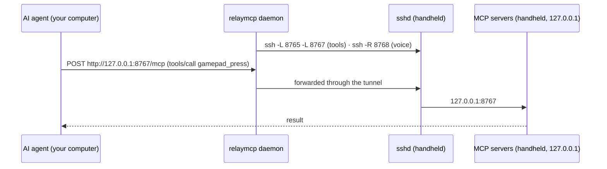

# How it works

RelayMCP has two halves: a small standard-library CLI and service on the computer that runs your AI agent, and a
runtime on the Windows handheld. They talk only over SSH.

## On your computer

| Piece | What it does |
|---|---|
| `relaymcp` CLI | Setup, health checks, kit building, logs, dev tools. Standard library only (Python 3.9+). |
| `relaymcp daemon` | The background service: two SSH connections (see below) plus the voice dispatcher on `127.0.0.1:8768`. Installed as a launchd agent (`dev.relaymcp.daemon`), a systemd user service (`relaymcp.service`), or a logon task (`RelayMCP-Daemon`). |
| `~/.relaymcp/` | `config.json`, the SSH key, `ssh_config`, `known_hosts` (the handheld's pinned host key), the built kit, logs and state. |

The daemon keeps **two independent SSH connections**:

- **tools:** `-L 127.0.0.1:8765 → handheld 127.0.0.1:8765` (Windows-MCP) and `-L 8767 → 8767` (hardware server)
- **voice:** `-R handheld 127.0.0.1:8768 → 127.0.0.1:8768` (the voice dispatcher)

They're separate so a stale voice port on the handheld (for example after a Wi-Fi blip) can never take the tools
down. While the handheld is away, asleep or offline, each connection quietly checks every 30 seconds. Only state
changes are logged (`relaymcp logs`).

## On the handheld

| Piece | Runs as | What it does |
|---|---|---|
| `RelayMCP-Controller` task | SYSTEM, at boot, at login, on network changes and every 15 min | Decides home vs. away and starts or stops SSH and the agent. Re-applies the SSH firewall scope. Logs changes to `C:\ProgramData\RelayMCP\controller.log`. |
| `RelayMCP-Agent` task | you, hidden (`pythonw.exe -m relaymcp.device.agent`) | Runs Windows-MCP and the hardware server, restarts them if they exit, and handles keep-awake. |
| Windows-MCP | child of the agent, `127.0.0.1:8765` | Screen control / computer use. |
| Hardware server | child of the agent, `127.0.0.1:8767` | Gamepad, touch, keys, audio, speech, display, power and voice prompts. |
| `RelayMCP-DismissControllerNotice` task | SYSTEM, on demand | Closes Armoury Crate's "external controller connected" prompt, which appears when the virtual gamepad plugs in. It has a fixed action and nothing else can be run through it. |
| sshd | Windows service (Manual start) | Key-only logins from your computer's key, firewall-scoped to the local subnet on Private networks. |

### Three ways in: which to use

| Channel | Runs as | Use it for |
|---|---|---|
| **Hardware MCP** (`ally-handheld`) | you, in the desktop session; per-monitor DPI-aware | Gamepad, touch, keys, mouse, focus, audio, speech, display, power |
| **Screen MCP** (`ally`, Windows-MCP) | you, in the desktop session; not elevated | Screenshots, UI automation, apps, clipboard, and PowerShell that needs the desktop (windows, UI state) |
| **SSH** (`relaymcp exec`, `relaymcp ssh`) | an elevated administrator in session 0, with no desktop | Services, files, installs, logs, and long-running processes you pipe commands into (e.g. a Bedrock Dedicated Server) |

Sharing the handheld:

- **Mark long work busy.** `relaymcp busy 90 --note "BDS test run"` tells updates (`scripts/rollout.sh`,
  `relaymcp deploy`) to wait; `relaymcp busy off` ends it, and `relaymcp busy` shows who's using the handheld. Updates
  also wait while a tool call happened in the last minute, a keep-awake lease is active, or a command runs over SSH.
- **One shared SSH connection, owned by the background service.** `ssh <device>` commands reuse it (so they start
  faster) but never become it, so one command ending can't cut off another. It runs detached from the service, so
  restarting the service doesn't drop it either. For a long-running process that must survive anything on this
  computer's side (a server you pipe commands into), add `-o ControlPath=none` to give it its own connection.

Things that trip agents up:

- **SSH can't see the desktop.** Windows, focus and GUI apps live in your session; commands over SSH run in a
  different one, so window titles come back empty and apps started there are invisible. Use the screen server's
  `PowerShell` tool (or `App`) for anything with windows.
- **Coordinates are physical pixels** in both MCP servers (screenshots, clicks, touch). PowerShell started by the
  screen server isn't DPI-aware, so Win32 calls there return scaled coordinates on a scaled display (175% on the ROG
  Ally). Call `SetProcessDPIAware()` at the start of such a script, or multiply by the scale.
- **Input goes to the foreground window.** Every input result reports `foreground` and warns when input probably went
  nowhere. `focus_window` (with `remember`) brings a window back and says what *really* has focus; the screen server's
  `App` switch can report success while Windows' foreground lock kept another window in front.

### Fast paths: keep the model out of the loop

In a real session most of the wall time is the model thinking between tool calls (70-90%, and each call's first
token gets slower as the context grows). So the hardware server offers ways to do more per model call, and to keep
fast reactions on the handheld:

| Need | Use | Why |
|---|---|---|
| See what's on screen | `observe` (text + tap points) | ~150 tokens and ~120 ms, versus ~1,900 tokens for a full-size screenshot |
| See graphics | `screenshot` | DXGI capture, small JPEG: ~70 ms and ~730 tokens; `only_if_changed` costs nothing when nothing moved |
| Do a sub-goal | `act` | one call for "focus the game, tap *Play*, wait for *Servers*", stopping at the first failure |
| React, repeat, follow | `behavior` | loops on the handheld at up to 240 Hz: react in ~35 ms, track a target, walk a menu to an item by its text, or run a small `script` state machine |
| Play in real time | `behavior` kind `program` | a short Python program at frame rate: hold several controls at once, aim, wait for text, stop on danger; one call per sub-goal |
| Talk to a console | `proc` | a game server or build: send a command, get its reply, wait for a log line |
| Exact game state | `state` inbox | a game server script or add-on POSTs JSON to the handheld; agents read or wait for it |
| Scripting | `powershell` | a warm, DPI-aware session: ~50 ms per call instead of 1.5-2.5 s, errors as plain text |

Behaviors are bounded: each has a time limit, releases every held input when it ends, and stops as soon as a real
controller moves (you can always take over).

### Real-time control, the robotics way

A model decides every 10-20 s; a game (or a drone's camera feed, or a robot) doesn't wait. RelayMCP splits control
the way dual-system robots do (a slow planner over a fast controller) and treats whatever is on the other end as an
unknown *plant* with a camera: nothing below is specific to one game.

1. **Stop the world when you can.** `focus_window(..., pause={"button": "start", "text": "Game is paused"})` makes a
   single-player game turn-based: it runs only while the agent's input runs, and screenshots show the frozen frame.
2. **Plan slow, act fast.** The model writes a short `program` per sub-goal (code as policy). It runs on the handheld
   at frame rate with a controller and perception API, and every wait checks its guards, the time limit and your
   hands on the controller. Like the async action-chunk queues of robot policies, the next program can be queued
   while one plays (`params.after`: it starts the moment that one finishes, and is dropped if it fails), and a
   running one can be replaced mid-move without letting go of what it holds (`params.replace`), so play doesn't
   stall for a model round trip between chunks.
3. **Identify the plant once.** `behavior` kind `calibrate` (about 20-30 s, once per game) probes the look stick
   and learns which pixels are HUD, the focal length, the response curve and deadzone (slow to fast), the
   input-to-picture latency, the ramp up and how far it coasts after letting go, pixels per degree (it turns all
   the way round and recognizes where it started, solving the focal length that makes that turn exactly 360
   degrees; a turn that lost track or missed its start is redone slower), the vertical gain, whether the stick
   is radial (the deadzone and curve apply to its length, as in Minecraft) or per-axis, and finally what an
   open-loop turn really does per axis (a deflection held for two lengths of time: the difference gives the true
   rate, the intercept the lag; steady rates measured over short stretches were 4.5% off for Minecraft's pitch). It
   never drives the camera faster than it
   can follow: past about 8% of the picture per captured frame, image matching aliases (a big miss reads as a
   small one, consistently: measured +44% at 41 degrees a frame with every frame "tracked"), so the curve, and
   control, stop below that, judged at the frame rate of the moment (a busy handheld captures fewer frames).
4. **Close the loop on pixels.** A visual gyro turns the picture into yaw and pitch: tiles over the middle of the
   picture (none on the HUD) are phase-correlated with a keyframe, each searched where the current estimate says it
   went, and the camera rotation that explains their shifts is fitted exactly (a pure rotation maps the picture by
   a homography, whatever the depth), robustly (a mob walking through a tile is dropped). When the predicted motion
   turns or stretches a tile (yawing while looking straight down is mostly roll), the tile is sampled through that
   local warp first, so matching still only has a small shift to find. A tilted camera's picture
   rolls as it yaws; that roll also gives its pitch, so `level` needs no pitch limit. Programs get `turn`,
   `level`, `look_at` (put a screen point under the crosshair) and `scan` in degrees. Turns feed forward through
   the inverse response curve, release early by the measured coast, keep following the picture through every
   pulse, and wait until the view has settled before correcting, like a servo's in-position check.
   The game's own instruments are sensors too: HUD numbers (Minecraft's coordinates) are read exactly in the game's
   pixel font, and looking straight down at a grid world, the texture's straight edges are a compass
   (`grid_angle`).
5. **Guard separately.** A `guard` behavior is a standing safety monitor, apart from the programs that come and go:
   when its condition holds (health dropping, a death screen) every program stops, a turn-based game pauses, an
   optional reflex program runs, and the next tool results carry an `alerts` entry. Guards only watch; they never
   judge a paused game or one whose pause menu is fading in or out, and their setup (baselines) runs on the first
   frame of the running game.
6. **Check before moving, remember what worked.** A program that uses a name nothing defines fails before the
   controller moves ("did you mean 'wait'?"). Programs that worked can be saved as named skills per game (`save`,
   `skills`), with their inputs worked out from the code and a record of how their runs went, so later sessions
   call them by name instead of re-sending and re-debugging code.

Built-in pieces were checked against existing libraries first: OpenCV, scikit-image, SLAM packages, system
identification toolkits, motion-profile and behavior-tree libraries, and LLM game-agent frameworks. None covers
rotation-only odometry with HUD masking, a deadzone-and-lag stick model, or servoing through a virtual gamepad, and
the numpy odometry costs ~2.5 ms per 1080p frame, so RelayMCP owns this layer. OpenCV's learned trackers, ruckig and
on-device open-vocabulary detection are candidates for later. The `handheld` custom agent and the `relaymcp-handheld` skill
(`relaymcp agent install`) teach these patterns to Copilot sessions.

### Home and away

"Home" means a connected network whose default gateway's MAC address is listed in
`C:\ProgramData\RelayMCP\home-gateways.txt` (recorded from your computer at setup). The MAC is freshly confirmed with
an ARP probe each time; a stale cache entry from another network is never trusted.

- **At home:** SSH runs, and the agent runs while someone is signed in. If the home network was marked *Public*, it
  becomes *Private* (so the SSH firewall rule applies).
- **On any other network:** SSH and the agent stop immediately. No other network's settings are touched.
- **Offline:** nothing changes for 10 minutes (so sleep and Wi-Fi blips don't churn), then everything stops.

### The agent and its servers (process lifecycle)

The agent is deliberately boring, so security software has nothing to flag:

- It starts with `pythonw.exe`: no window and no console. There are no `cmd /c` loops, no `conhost --headless`, and no
  script-based restart loops. (Earlier prototypes used those, and Microsoft Defender's ML heuristics flagged the
  pattern.)
- Each server is started as `python.exe -m ...` with `CREATE_NO_WINDOW`. It gets a hidden console, and the console
  programs it starts (PowerShell, for example) inherit it, so no window ever flashes on screen.
- Each server sits in its own **kill-on-close job object**, so the servers end whenever the agent ends, however it
  ends. The jobs allow *silent breakaway*, so apps a server launches for you (a game, Notepad) are never killed with
  it.
- A server that exits is restarted with exponential backoff (2 s … 60 s); five healthy minutes reset the backoff.
  Output goes to size-capped logs in `%LOCALAPPDATA%\RelayMCP\`.
- **Keep-awake:** while at home, the agent holds the system and display awake if there was an MCP tool call or an SSH
  command in the last 10 minutes, or while a lease (`relaymcp awake`) is active. Otherwise it holds nothing and the
  handheld sleeps normally.

Status is written to `%LOCALAPPDATA%\RelayMCP\agent-status.json`, which `relaymcp doctor` reads over SSH.

### Voice prompts

See [voice.md](voice.md). In short: the hardware server listens for the View + Menu chord (via XInput), a global
hotkey and the *Ask Copilot* shortcut. It records until you stop talking, transcribes locally, and POSTs the text to
its own `127.0.0.1:8768`. That's the reverse tunnel to your computer's dispatcher, which runs your agent and returns
the reply to be spoken.

## File locations

**Your computer**

| Path | Contents |
|---|---|
| `~/.relaymcp/config.json` | Settings ([reference](configuration.md)) |
| `~/.relaymcp/id_ed25519`, `ssh_config`, `known_hosts` | RelayMCP's SSH identity, host entry and the handheld's pinned host key |
| `~/.relaymcp/kit/<name>/` | The handheld's setup kit |
| `~/.relaymcp/logs/daemon.log` | Tunnel state changes and voice prompts |
| `~/.relaymcp/state/` | Daemon status, voice session, SSH control sockets |

**Handheld**

| Path | Contents |
|---|---|
| `C:\ProgramData\RelayMCP\` | `Relay-Setup.ps1` (repair/uninstall), `controller.ps1`, `device.json`, `state.txt`, `home-gateways.txt`, `setup.log`, `controller.log` |
| `%LOCALAPPDATA%\RelayMCP\` | Agent and server logs, `agent-status.json`, keep-awake lease, recordings, speech models |
| `%APPDATA%\uv\tools\relaymcp-device`, `...\windows-mcp` | The two Python environments (managed by uv) |
