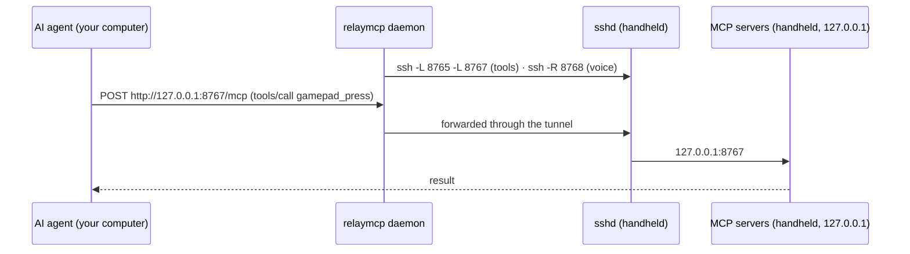

# How it works

RelayMCP has two halves: a small standard-library CLI and service on the computer that runs your AI agent, and a
runtime on the Windows handheld. They talk only over SSH.

## On your computer

| Piece | What it does |
|---|---|
| `relaymcp` CLI | Setup, health checks, kit building, logs, dev tools. Standard library only (Python 3.9+). |
| `relaymcp daemon` | The background service: two SSH connections (see below) plus the voice dispatcher on `127.0.0.1:8768`. Installed as a launchd agent (`dev.relaymcp.daemon`), a systemd user service (`relaymcp.service`), or a logon task (`RelayMCP-Daemon`). |
| `~/.relaymcp/` | `config.json`, the SSH key, `ssh_config`, `known_hosts` (the handheld's pinned host key), the built kit, logs and state. |

The daemon keeps **two independent SSH connections**:

- **tools:** `-L 127.0.0.1:8765 → handheld 127.0.0.1:8765` (Windows-MCP) and `-L 8767 → 8767` (hardware server)
- **voice:** `-R handheld 127.0.0.1:8768 → 127.0.0.1:8768` (the voice dispatcher)

They're separate so a stale voice port on the handheld (for example after a Wi-Fi blip) can never take the tools
down. While the handheld is away, asleep or offline, each connection quietly checks every 30 seconds. Only state
changes are logged (`relaymcp logs`).

## On the handheld

| Piece | Runs as | What it does |
|---|---|---|
| `RelayMCP-Controller` task | SYSTEM, at boot, at login, on network changes and every 15 min | Decides home vs. away and starts or stops SSH and the agent. Re-applies the SSH firewall scope. Logs changes to `C:\ProgramData\RelayMCP\controller.log`. |
| `RelayMCP-Agent` task | you, hidden (`pythonw.exe -m relaymcp.device.agent`) | Runs Windows-MCP and the hardware server, restarts them if they exit, and handles keep-awake. |
| Windows-MCP | child of the agent, `127.0.0.1:8765` | Screen control / computer use. |
| Hardware server | child of the agent, `127.0.0.1:8767` | Gamepad, touch, keys, audio, speech, display, power and voice prompts. |
| `RelayMCP-DismissControllerNotice` task | SYSTEM, on demand | Closes Armoury Crate's "external controller connected" prompt, which appears when the virtual gamepad plugs in. It has a fixed action and nothing else can be run through it. |
| sshd | Windows service (Manual start) | Key-only logins from your computer's key, firewall-scoped to the local subnet on Private networks. |

### Three ways in: which to use

| Channel | Runs as | Use it for |
|---|---|---|
| **Hardware MCP** (`ally-handheld`) | you, in the desktop session; per-monitor DPI-aware | Gamepad, touch, keys, mouse, focus, audio, speech, display, power |
| **Screen MCP** (`ally`, Windows-MCP) | you, in the desktop session; not elevated | Screenshots, UI automation, apps, clipboard, and PowerShell that needs the desktop (windows, UI state) |
| **SSH** (`relaymcp exec`, `relaymcp ssh`) | an elevated administrator in session 0, with no desktop | Services, files, installs, logs, and long-running processes you pipe commands into (e.g. a Bedrock Dedicated Server) |

Things that trip agents up:

- **SSH can't see the desktop.** Windows, focus and GUI apps live in your session; commands over SSH run in a
  different one, so window titles come back empty and apps started there are invisible. Use the screen server's
  `PowerShell` tool (or `App`) for anything with windows.
- **Coordinates are physical pixels** in both MCP servers (screenshots, clicks, touch). PowerShell started by the
  screen server isn't DPI-aware, so Win32 calls there return scaled coordinates on a scaled display (175% on the ROG
  Ally). Call `SetProcessDPIAware()` at the start of such a script, or multiply by the scale.
- **Input goes to the foreground window.** Every input result reports `foreground` and warns when input probably went
  nowhere. `focus_window` (with `remember`) brings a window back and says what *really* has focus; the screen server's
  `App` switch can report success while Windows' foreground lock kept another window in front.

### Home and away

"Home" means a connected network whose default gateway's MAC address is listed in
`C:\ProgramData\RelayMCP\home-gateways.txt` (recorded from your computer at setup). The MAC is freshly confirmed with
an ARP probe each time; a stale cache entry from another network is never trusted.

- **At home:** SSH runs, and the agent runs while someone is signed in. If the home network was marked *Public*, it
  becomes *Private* (so the SSH firewall rule applies).
- **On any other network:** SSH and the agent stop immediately. No other network's settings are touched.
- **Offline:** nothing changes for 10 minutes (so sleep and Wi-Fi blips don't churn), then everything stops.

### The agent and its servers (process lifecycle)

The agent is deliberately boring, so security software has nothing to flag:

- It starts with `pythonw.exe`: no window and no console. There are no `cmd /c` loops, no `conhost --headless`, and no
  script-based restart loops. (Earlier prototypes used those, and Microsoft Defender's ML heuristics flagged the
  pattern.)
- Each server is started as `python.exe -m ...` with `CREATE_NO_WINDOW`. It gets a hidden console, and the console
  programs it starts (PowerShell, for example) inherit it, so no window ever flashes on screen.
- Each server sits in its own **kill-on-close job object**, so the servers end whenever the agent ends, however it
  ends. The jobs allow *silent breakaway*, so apps a server launches for you (a game, Notepad) are never killed with
  it.
- A server that exits is restarted with exponential backoff (2 s … 60 s); five healthy minutes reset the backoff.
  Output goes to size-capped logs in `%LOCALAPPDATA%\RelayMCP\`.
- **Keep-awake:** while at home, the agent holds the system and display awake if there was an MCP tool call or an SSH
  command in the last 10 minutes, or while a lease (`relaymcp awake`) is active. Otherwise it holds nothing and the
  handheld sleeps normally.

Status is written to `%LOCALAPPDATA%\RelayMCP\agent-status.json`, which `relaymcp doctor` reads over SSH.

### Voice prompts

See [voice.md](voice.md). In short: the hardware server listens for the View + Menu chord (via XInput), a global
hotkey and the *Ask Copilot* shortcut. It records until you stop talking, transcribes locally, and POSTs the text to
its own `127.0.0.1:8768`. That's the reverse tunnel to your computer's dispatcher, which runs your agent and returns
the reply to be spoken.

## File locations

**Your computer**

| Path | Contents |
|---|---|
| `~/.relaymcp/config.json` | Settings ([reference](configuration.md)) |
| `~/.relaymcp/id_ed25519`, `ssh_config`, `known_hosts` | RelayMCP's SSH identity, host entry and the handheld's pinned host key |
| `~/.relaymcp/kit/<name>/` | The handheld's setup kit |
| `~/.relaymcp/logs/daemon.log` | Tunnel state changes and voice prompts |
| `~/.relaymcp/state/` | Daemon status, voice session, SSH control sockets |

**Handheld**

| Path | Contents |
|---|---|
| `C:\ProgramData\RelayMCP\` | `Relay-Setup.ps1` (repair/uninstall), `controller.ps1`, `device.json`, `state.txt`, `home-gateways.txt`, `setup.log`, `controller.log` |
| `%LOCALAPPDATA%\RelayMCP\` | Agent and server logs, `agent-status.json`, keep-awake lease, recordings, speech models |
| `%APPDATA%\uv\tools\relaymcp-device`, `...\windows-mcp` | The two Python environments (managed by uv) |
